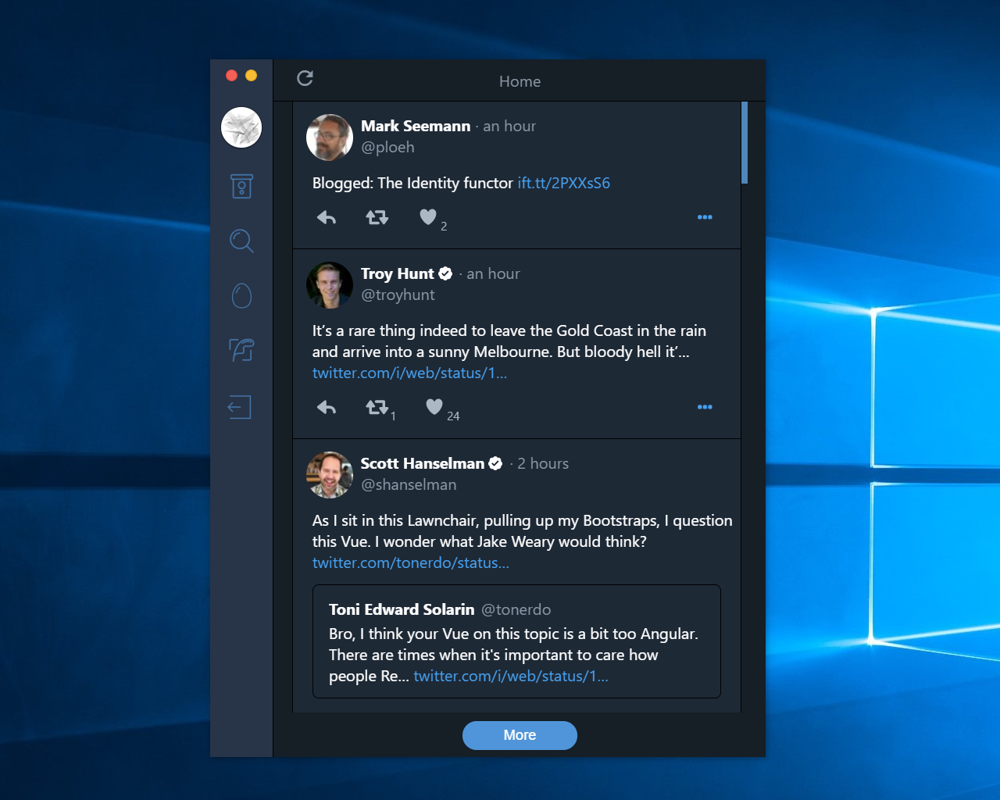

    <h3 align="center" style="margin-bottom: -10px;">TwitterTron</h3>
    
Twitter desktop app.

## **Download**

Currently, only Windows is supported.

## **Changes**

_v0.10_

- add multiple themes capability
- embed tweets
- add tweet photo viewer
- handle outside click for header actions
- handle error case for apis
- fix application development issue
-

_v0.9_

- add sign out button
- add rate-limit exceed dialog
- add reply functionality
- UI enhancements
- add windows installers
- add compose tweet page
- new icons
- add about page
- add small loading indicator when retweeting & favoriting
- add support for quoted status
- tweak playercard design
- add verification to playercard

_v0.8_

- reduce package size by 44%
- add refresh functionality
- add avatar component to leftnavbar
- fix padding issue for playercard & spinner
- fix search page layout
- fix do not display 0 as a retweet & favorite count
- add topnavbar
- implement dark theme
- tweak tweets design
- add spinner

_v0.7_

- UI enhancements
- style changes for leftnavbar
- add search result type options menu
- reduce package size by 49%
- add packaging support
- add live-reloading during development
- better login workflow
- add icon for retweets

_v0.6_

- UI enhancements
- add search page functionality
- add characters left indicator for textbox
- fix problem with retweeting & favoriting retweeted tweets
- add tweetbox styling

_v0.5_

- fix titlebar not draggable when overlayed
- add simple tweet post implementation
- add tweet status
- add constent screen for media
- add rate limit indicator
- add link interceptor
- convert to a more modern react-redux architecture

_v0.4_

- UI enhancements
- add search feature
- add playercards
- add tweet posted time
- enable media rendering

_v0.3_

- refine tweetcards
- add follow feature
- add ci integration
- convert from systemjs to webpack
- implement pagination for hometimeline

_v0.2_

- redesign project to use reactjs
- add retweet, favorite feature
- refactor authentication code

_v0.1_

- init basic functionality

## **Credits**

Credits to [Denis Domanitsky](https://www.iconfinder.com/iconsets/twitter-ui-set) for most of the icons, under the [Attribution 3.0 Unported (CC BY 3.0)](https://creativecommons.org/licenses/by/3.0/) licence.

## **License**

This product is licensed under the [GPL-3.0](./LICENSE.md) license.

---

    Made with :heart: by <a href="https://github.com/afractal">@afractal</a>

